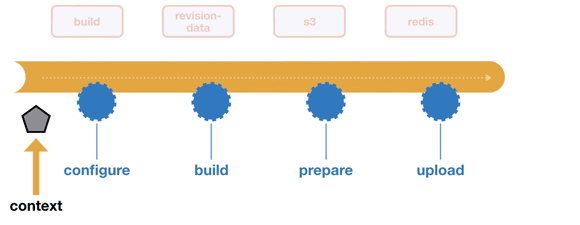

For each high-level ember-cli-deploy operation, a `context` object is created.

This object is passed to each hook that is invoked on the plugins.
It has a number of properties that may be of use to a plugin:

property | file | info
--- | --- | ---
`ui` | - | The ember-cli UI object used to write to stdout.
`project` | - | The ember-cli project object.
`config` | `config/deploy.js` | The configuration returned by the config file for the active environment.
`deployTarget` | - | The deploy target


In order to pass runtime information about the current operation, plugins can set properties on the `context` object for later use by themselves or for another plugin.
They do this by simply returning a simple hash from their hooks.

When a hook is invoked its return value is **merged** back into the context Object.

## Example


The `ember-cli-deploy-revision-data` plugin uses its `prepare` hook to return an object with this shape:
`{ revisionData: ... }`.

Later in the lifecycle the `ember-cli-deploy-redis` plugin can find the same `revisionData` key in the `context` object that is passed to its `upload` hook, and use it to determine the key to use for saving the `index.html` file in redis.

## Opting out of array concatenation

When the hash returned from a hook contains an array, and the context also contains an array under a property of the same name, then ember-cli-deploy will concatenate them together. Example:

```js
// Initial context
{
  pets: ['cat', 'dog']
}

// Return value of your hook
{
  pets: ['dog', 'hamster']
}

// Resulting context
{
  pets: ['cat', 'dog', 'dog', 'hamster']
}
```

In most scenarios, this is very convenient: every hook enriches the context with more values.

If this behavior is undesirable and instead you would like to replace the array, mention the array's property name in `_keysToDisableConcatenation` like this:

```js
// Initial context
{
  pets: ['cat', 'dog']
}

// Return value of your hook
{
  _keysToDisableConcatenation: ['pets'],
  pets: ['dog', 'hamster']
}

// Resulting context
{
  pets: ['dog', 'hamster']
}
```
